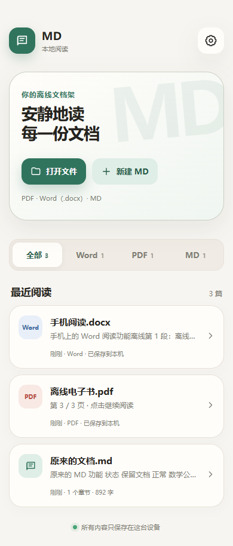

# MD · 离线文档阅读器

一个用于手机本地阅读的轻量工具，支持 **PDF、Word（.docx）和 Markdown**。无需登录，导入的文件保存在本机，断网也能继续阅读。

[下载最新 Android 安装包](https://github.com/Mj-coder686/md-app/releases/latest/download/MD.apk) · [查看版本与更新说明](https://github.com/Mj-coder686/md-app/releases/latest)

仓库目前为私有，下载需要登录有访问权限的 GitHub 账号。

## 1.2 新功能

- **分类文档架**：全部、Word、PDF、MD 四个入口，显示最近阅读。
- **PDF**：保留原排版，左右滑动或按钮翻页，输入页码跳转，支持放大、缩小及双指缩放。放大后可拖动查看页面，恢复到 100% 后可滑动翻页。
- **Word**：读取 `.docx` 的标题、文字、表格和内嵌图片，按手机屏幕重排，支持字号调整、目录与搜索。
- **记住位置**：每份文件独立保存阅读位置和缩放比例，再次打开继续阅读。
- **完全离线阅读**：文件导入后保存到本机，PDF 字体与解码资源随安装包提供，阅读无需网络。
- **原有 MD 功能**：阅读、编辑、表格、任务清单、数学公式、代码高亮、目录、搜索和阅读主题均保留。



## 使用

1. 下载 `MD.apk` 并安装。已有旧版时直接覆盖安装，保留本机文档和设置。
2. 点击「打开文件」，选择手机中的 PDF、Word（.docx）或 MD 文件；也可以从其他应用选择用 MD 打开或分享给 MD。
3. 在阅读页面翻页或调整大小。返回首页后，可在最近阅读或对应分类中继续打开。

Word 暂支持 `.docx`，旧 `.doc` 请先另存为 `.docx` 或 PDF。Word 以适合手机阅读的方式显示，复杂排版可能与原文件不同。PDF 保留原页面，不提供小说式文字重排；加密 PDF 暂不支持。单个导入文件上限为 80 MB。

## 开发与验证

项目使用 TypeScript、Vite 和 Capacitor；PDF 基于 [PDF.js](https://github.com/mozilla/pdf.js)，DOCX 基于 [Mammoth](https://github.com/mwilliamson/mammoth.js)，Markdown 使用 Marked、DOMPurify、KaTeX 和 Highlight.js。

```sh
npm ci
npm run dev
npm run build
npm run sync
```

`npm run sync` 将构建资源复制到 Android 工程。Android 构建需要 JDK 21 和相应 Android SDK。此版本沿用旧 APK 的本机 Android 调试签名，以便覆盖安装。

```sh
# 设置 CHROME_PATH 指向 Chrome/Chromium，然后运行离线阅读集成检查。
npm test
# Windows
android\gradlew.bat -p android assembleDebug
```

自动检查覆盖旧版 MD 数据迁移、编辑保存、分类、PDF 翻页/滑动/缩放、Word 标题/表格/内嵌图片/搜索、断网重开和位置恢复、重复导入、损坏文件与空间不足回滚。Android 安装包构建和签名检查已通过，尚未进行真机测试。

详见 [更新记录](CHANGELOG.md)。
