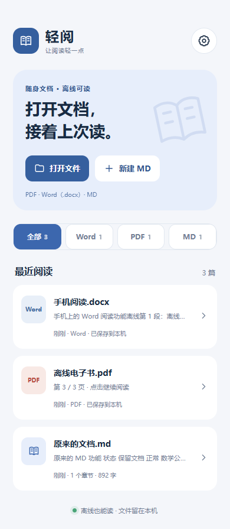

# 轻阅 · 离线文档阅读器

一个用于手机本地阅读的轻量工具，支持 **PDF、Word（.docx）和 Markdown**。无需登录，导入的文件保存在本机，断网也能继续阅读。

[查看 1.3 测试版与下载附件](https://github.com/Mj-coder686/md-app/releases/tag/v1.3.0) · [更新说明](CHANGELOG.md)

旧 1.2 安装包被用户的小米手机管家标记为 `a.gray.BulimiaTGen.f`。目前不能确认误报，也尚未验证新包是否被该引擎放行。如果手机仍提示高风险，请先不要绕过提示安装。1.3 使用关闭调试标记的 release 构建，沿用旧证书以兼容覆盖升级。

安装包与校验文件在版本页面的附件中提供。

## 1.3 新功能

- **新名称与界面**：从 MD 升级为轻阅，重做文档架、阅读工具栏、主题与应用图标。
- **双指缩放**：Word、MD 和 PDF 都能用手指捏合调整大小，底部按钮作为辅助。
- **减少停顿**：PDF 缓存与下一页预绘制、保留旧页面直至新页就绪；滚动保存延后执行，文件切换不再重复写正文。
- **PDF 兼容修复**：使用 legacy 主模块与工作线程，修复已复现的「有页数但无页面」问题。

- **分类文档架**：全部、Word、PDF、MD 四个入口，显示最近阅读。
- **PDF**：保留原排版，左右滑动或按钮翻页，输入页码跳转，支持放大、缩小及双指缩放。放大后可拖动查看页面，恢复到 100% 后可滑动翻页。
- **Word**：读取 `.docx` 的标题、文字、表格和内嵌图片，按手机屏幕重排，支持双指缩放、目录与搜索，无需安装 Word。
- **记住位置**：每份文件独立保存阅读位置和缩放比例，再次打开继续阅读。
- **完全离线阅读**：文件导入后保存到本机，PDF 字体与解码资源随安装包提供，阅读无需网络。
- **原有 MD 功能**：阅读、编辑、表格、任务清单、数学公式、代码高亮、目录、搜索和阅读主题均保留。



## 使用

1. 在测试版页面下载 `Qingyue.apk`。同一证书支持覆盖升级并保留本机文档和设置；手机仍报高风险时请暂停安装。
2. 点击「打开文件」，选择手机中的 PDF、Word（.docx）或 MD 文件；也可以从其他应用选择用轻阅打开或分享给轻阅。
3. 双指分开放大、捏合缩小；PDF 放大后拖动查看，恢复 100% 后左右滑动翻页。返回首页后，可从分类或最近阅读继续打开。

Word 暂支持 `.docx`，旧 `.doc` 请先另存为 `.docx` 或 PDF。Word 以适合手机阅读的方式显示，复杂排版可能与原文件不同。PDF 保留原页面，不提供小说式文字重排；加密 PDF 暂不支持。单个导入文件上限为 80 MB。

## 开发与验证

项目使用 TypeScript、Vite 和 Capacitor；PDF 基于 [PDF.js](https://github.com/mozilla/pdf.js)，DOCX 基于 [Mammoth](https://github.com/mwilliamson/mammoth.js)，Markdown 使用 Marked、DOMPurify、KaTeX 和 Highlight.js。

```sh
npm ci
npm run dev
npm run build
npm run sync
```

`npm run sync` 将构建资源复制到 Android 工程。Android 构建需要 JDK 21 和相应 Android SDK。release 关闭调试标记，但仍使用原有本机 Android Debug 证书，以便覆盖升级；维护者本机证书未提交到仓库。其他开发者自行构建可能无法覆盖现有安装。面向正式分发的签名迁移与小米警报排查仍需后续处理。

```sh
# 设置 CHROME_PATH 指向 Chrome/Chromium，然后运行离线阅读集成检查。
npm test
# Windows
android\gradlew.bat -p android assembleRelease
# 模拟主页面与 PDF 工作线程缺少部分较新接口
# PowerShell: $env:READER_OLDER_WEBVIEW='1'; node tests/readers.mjs
```

自动检查覆盖旧版 MD 数据迁移、编辑保存、分类、PDF 像素/翻页/缓存/双指缩放、Word 标题/表格/图片/双指缩放/搜索、断网重开、位置与比例恢复、重复导入、损坏文件与空间不足回滚。浏览器检查通过不等于 Android 真机验证，实际手机流畅度与小米警报仍待复查。

详见 [更新记录](CHANGELOG.md)。
